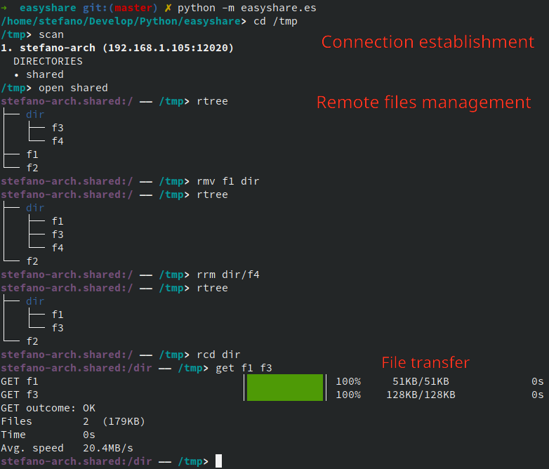
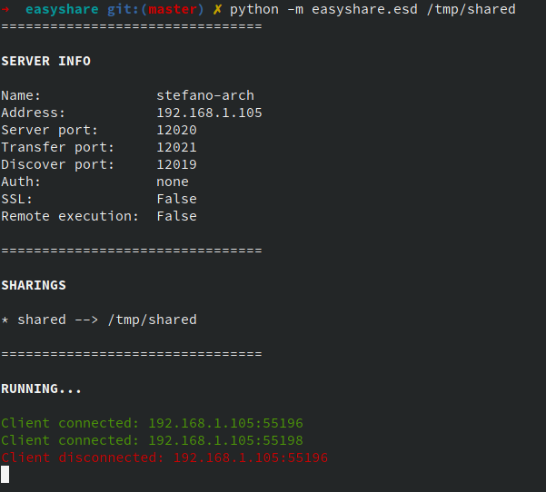

Easyshare
====

DESCRIPTION
------------
**easyshare** is a client-server command line application written in Python for transfer files between network hosts.  
It is highly inspired by FTP, but aim to be easier and faster to use.  
For example, **easyshare** supports automatic discovery of the *sharings* of the network, 
therefore, from the client you can download entire directories just by giving the name
you assigned to them from the server side.

REQUIREMENTS
------------

Requires at least Python 3.6.

INSTALLATION
------------
On Linux, you can install it with pip:
```
sudo pip install easyshare
```

This will install both **es** (client) and **esd** (server).

WHAT IT LOOKS LIKE
-----

*A picture is worth a thousand words*


##### es (client)




##### esd (server)




## esd

#### USAGE
```
esd [OPTION]... [SHARING [SHARING_NAME] [SHARING_OPTION]...]
```

For share stuff, you have to start an easyshare daemon (**esd**).

There are basically two ways for create *sharings*.
1. By providing the path of the file/directory to share in the command line as SHARING
2. By creating a configuration file and specifying it with the option -c config

The option 1. should be preferred for an easy one-shot sharing of a file or directory, since 
doesn't need the creation a configuration file, but has the limit that only a file or folder 
can be shared.

If given, SHARING must be a valid path to a local file or directory.
SHARING_NAME is an optional name to assign to the sharing, as it will be seen by clients. If 
not given, the name of the file/directory is used instead.
Currently the only supported SHARING_OPTION is the read-only flag, which can be enabled with 
-r, and denies any write operation on a directory sharing.

#### OPTIONS
```
-a, --address  address        server address (default is primary interface)
-c, --config  config_path     load settings from a esd configuration file
-d, --discover-port  port     port used to listen to discovery messages (default is 12021)
-e, --rexec                   enable rexec (remote execution)
-h, --help                    show this help
-n, --name  name              server name
--no-color                    don't print ANSI escape characters
-P, --password  password      server password, plain or hashed with es-tools
-p, --port  port              server port (default is 12020)
--ssl-cert  cert_path         path to an SSL certificate
--ssl-privkey  privkey_path   path to an SSL private key
-t, --trace  0_or_1           enable/disable tracing
-v, --verbose  level          set verbosity level
-V, --version                 show the easyshare version
```

#### CONFIGURATION

The server can be configured either with a configuration file (2.) or by giving **esd** the options
you need. The command line arguments have precedence over the corresponding setting of the
configuration file (i.e. if you specify an option in both the configuration file and as an argument, 
the argument will be taken into account).

The configuration file is composed of two parts.
1. Global section
2. Sharings sections

Each line of a section has the form \<key\>=\<value\>.
The available \<key\> of the global section are:
```
    address
    discover_port
    name
    no_color
    password
    port
    rexec
    ssl
    ssl_cert
    ssl_privkey
    trace
    verbose
```

The available \<key\> of the sharings sections are:
```
    path
    readonly
```

The first lines of the configuration file belongs to the global section by default.
Each sharing section begins with "\[SHARING_NAME\]".
If you omit the SHARING_NAME, the name of the shared file or directory will be used instead.

See the example of the configuration file below for more details.


#### EXAMPLES
* Share a file
```
esd /tmp/file
```

* Share a directory, assigning it a name
```
esd  /tmp/shared_directory shared
```

* Share multiples directories, using a configuration file 
```
esd -c /home/user/.easyshare/esd.conf
```


##### CONFIGURATION FILE EXAMPLE
```
# esd.conf

# ===== SERVER SETTINGS =====

name=stefano-arch
password=aSecurePassword

port=12020
discover_port=12019

ssl=true
ssl_cert="/tmp/cert.pem"
ssl_privkey="/tmp/privkey.pem"
ssl_privkey="/tmp/privkey.pem"

rexec=false

verbose=4
trace=1

# ===== SHARINGS =====

[download]
    path="/home/stefano/Downloads"

[shared]
    path="/tmp/shared"
    readonly=true

# Automatic sharing name
[]
    path="/tmp/afile"
```


## es


#### USAGE
```
es [OPTION]... [COMMAND [COMMAND_ARGUMENTS]]
```

For fetch stuff shared with **esd**, you have to start an easyshare client (**es**).

If no COMMAND is given, the interactive console is started, from which you can use any command.  
If COMMAND is a valid command, it is executed and the process quits unless the command is *open*.

#### OPTIONS
```
-d, --discover-port  port      port used for broadcast discovery messages
-h, --help                     show this help
--no-color                     don't print ANSI escape characters
-t, --trace  0_or_1            enable/disable tracing
-v, --verbose  level           set verbosity level
-V, --version                  show the easyshare version
-w, --discover-wait  seconds   time to wait for discovery responses
```

#### COMMANDS

From within the **es** console, type "help \<command\>" for the full documentation of a command.

The available commands (either from the command line or from the interactive console) are the following:

##### General commands
```
help             show this help
exit, quit, q    exit from the interactive shell
trace, t         enable/disable packet tracing
verbose, v       change verbosity level
```

The *help* command should really be used since its quite complete.

##### Connection establishment commands
```
scan, s          scan the network for easyshare servers
connect          connect to a remote server
disconnect       disconnect from a remote server
open, o          open a remote sharing (eventually discovering it)
close, c         close the remote sharing
```

The most straightforward way to establish a connection is *open* since only requires you
to know the name assigned to the sharing.  

*scan* can be used for discover the sharings of the network (for figure out the name to give to *open*).

Tipically you won't need to use *connect* explicitly since the server connection
is automatically established, if the sharing name given to *open* is valid and can be found.
Although there might be cases in which an explicit *connect* is needed, for example for
connect to a server for which the discovery cannot be performed
(i.e. a server not on the same network of the client) or if you want to connect a server without
sharings (e.g. for execute commands remotely via *rexec*).


##### Transfer commands
```
get, g          get files and directories from the remote sharing
put, p          put files and directories in the remote sharing
```

*get* is used for:
* Download files or directories from a "directory sharing"
* Download a shared file ("file sharing")

*put* is used for:
* Upload files or directories to a "directory sharing"

##### Local commands
```
pwd              show the name of current local working directory
ls               list local directory content
l                alias for ls -la
tree             list local directory contents in a tree-like format
cd               change local working directory
mkdir            create a local directory
cp               copy files and directories locally
mv               move files and directories locally
rm               remove files and directories locally
exec, :          execute an arbitrary command locally
```

You should really be familiar with these commands since behave quite similar 
to the Linux counterpart.

The command *exec* (which can be shortened with *:*) can be useful for execute arbitrary commands
without the need of open a new terminal.

##### Remote commands
```
rpwd             show the name of current remote working directory
rls              list remote directory content
rl               alias for rls -la
rtree            list remote directory contents in a tree-like format
rcd              change remote working directory
rmkdir           create a remote directory
rcp              copy files and directories remotely
rmv              move files and directories remotely
rrm              remove files and directories remotely
rexec, ::        execute an arbitrary command remotely (disabled by default) since it will compromise server security
```

These are the counterparts of the **Local commands** that work on the remote sharing
instead of the local machine (i.e. you have to establish a connection to a "directory sharing"
before use those).

The command *rexec* (which can be shortened with *::*) is a really powerful command
that basically gives you arbitrary command execution on the remote machine 
(technically not a shell, but not so far).  
For this reason, it is obviously disabled by default, but you can enable it with the
option **-e** if you are really confident that nobody with bad intentions will use it
(use a strong server password, by the way).

##### Server information commands
```
info, i          show information about the remote server
list             list the sharings of the remote server
ping             test the connection with the remote server
```

*info* can be used for fetch information of the remote server 
(e.g. name, address, ports, SSL certificate, type of authentication, available sharings).

#### EXAMPLES

These are only examples, see the *help* section of each command for known exactly
what you can do.

* Start the interactive shell (from which you can use any command)
```
es
```
 
* Scan the network for easyshare sharings
```
es scan

alice-arch (192.168.1.105:12020)
  DIRECTORIES
  - shared
  - tmp
```


* Open a sharing by name (implicit discovery and server connection) and start the interactive shell
```
es open shared

alice-arch.shared:/ - /tmp>
...
```

* Get the content of a sharing by name
```
es get shared

GET shared/f1    [===================] 100%  745KB/745KB
GET outcome: OK
Files        1  (745KB)
Time         1s
Avg. speed   1MB/s
```

* Open a sharing by name and put some files into it
```
es

/tmp> open shared
alice-arch.shared:/ - /tmp> rls
f1      f2
alice-arch.shared:/ - /tmp> put /tmp/afile
PUT afile    [===================] 100%  745KB/745KB
PUT outcome: OK
Files        1  (745KB)
Time         1s
Avg. speed   1MB/s
alice-arch.shared:/ - /tmp> rls
f1      f2      afile
```

* Connect to a server by specific address and port, then list the available sharings
```
es connect 192.168.1.105:12020

alice-arch:/ - /tmp> list
DIRECTORIES
- shared
- tmp
FILES
- zshrc
```

* See content of the remote sharing, then move some files
```
es 
/tmp> open shared
alice-arch.shared:/ - /tmp> rtree
/tmp> tree
|-- dir
|   |-- f3
|   +-- f4
|-- f1
+-- f2
alice-arch.shared:/ - /tmp> rmv f1 f2 dir
alice-arch.shared:/ - /tmp> rtree
+-- dir
    |-- f1
    |-- f2
    |-- f3
    +-- f4
alice-arch.shared:/ - /tmp> rcd dir
alice-arch.shared:/dir - /tmp> rls
f1      f2      f3      f4
```

* Arbitrary local command execution
```
es 
/tmp> cd d
/tmp/d> ls
f0  
/tmp> :touch f1
f0      f1
```

* Arbitrary remote command execution (DISABLED BY DEFAULT)
```
es 
/tmp> connect alice-arch
alice-arch:/ - /tmp> ::whoami
alice
```

## es-tools

*es-tools* is a little script that can help administrators of easyshare servers.  

Currently in two ways:
1. Creating a default configuration file
2. Generating an hash of a password to use in the **esd** configuration file (preferred over a plain password)


#### USAGE
```
es-tools [OPTION]...
```

If neither **-c** nor **-p** is given, an interactive script is started and you will be asked what to do.

#### OPTIONS
```
-c, --generate-config             generate default esd.conf file
-h, --help                        show this help
-p, --hash-password  <password>   generate an hash of the password
-V, --version                     show the easyshare version
```

## TODO
* Testing on Windows
* *find* and *rfind* command that finds files by name and tag those with incremental IDs (1, 2)
which can be used in other command (something like $1, $2)


LICENSE
-------

Easyshare is [MIT licensed](./LICENSE>).
